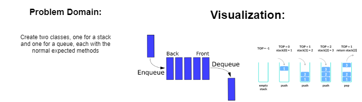

# Stacks and Queues

Create a class called AnimalShelter which holds only dogs and cats. The shelter operates using a first-in, first-out approach.

## Challenge

Create two classes, one for dogs and one for cats. Then create a class for animal shelter that holds two Queus from the Queue class, that has the methods written before

## Approach & Efficiency

Time O(1) for all.

## Solution

