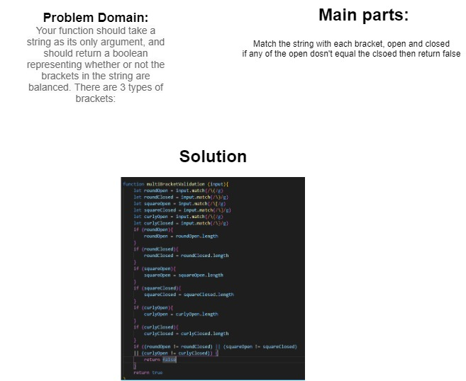

# Challenge Summary
Make a node class and a linked list class [Extension]
## Challenge Description
Your function should take a string as its only argument, and should return a boolean representing whether or not the brackets in the string are balanced. There are 3 types of brackets: () {} []
## Approach & Efficiency
Match each type of bracket in the input, get the length, if closed == open then its true, else its false
## Solution
